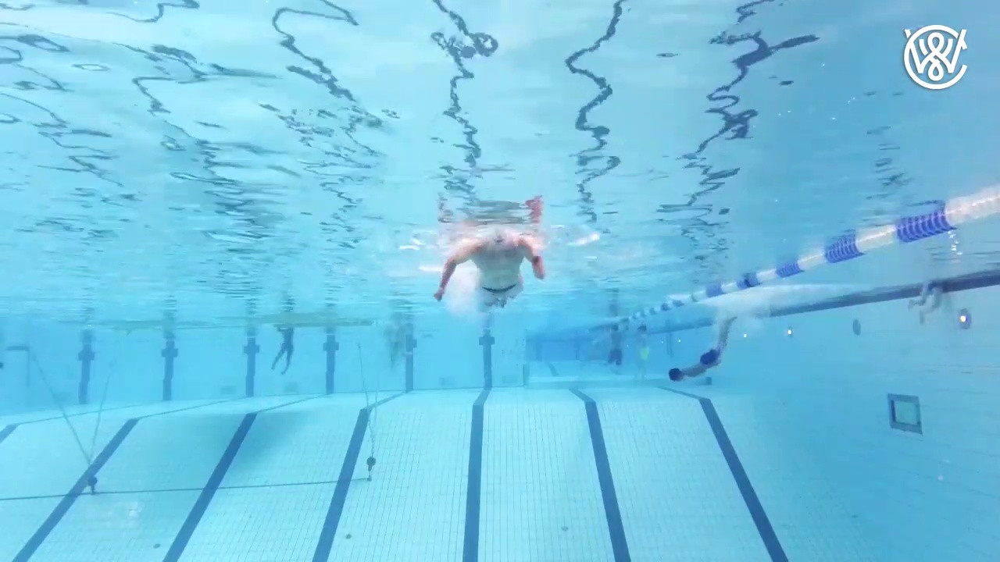

# Drowning Detection Web App

A web application for detecting drowning incidents in images and videos using YOLOv8 AI model.

## Features

- Upload images or videos for drowning detection
- Real-time AI analysis using YOLOv8
- Visual results with bounding boxes
- Detection confidence scores
- Alert system for drowning incidents
- **Video analysis with sample frames** (processes every 120th frame, shows 10 representative frames)
- **Final prediction verdict** with confidence level for videos
- Summary reports for video analysis

## Installation

1. Clone or download the repository
2. Navigate to the project directory
3. Install dependencies:
   ```bash
   pip install -r requirements.txt
   ```

## Usage

1. Run the Flask application:
   ```bash
   python app.py
   ```

2. Open your web browser and go to `http://127.0.0.1:5000/`

3. Upload an image or video and click "Analyze"

4. For images: View the detection results with highlighted areas
5. For videos: View sample frame analysis and **final prediction verdict** (DROWNING DETECTED / NO DROWNING DETECTED)

## Screenshots

### Homepage
The modern web interface with gradient background and intuitive upload form.


*Modern homepage with gradient background, upload form for images and videos, and feature highlights.*

### Detection Results
Sample detection results showing the AI model's performance:





*These images demonstrate the drowning detection system's ability to identify and highlight potential drowning incidents with bounding boxes and confidence scores.*

### Results Page Interface

*Results page showing image comparison, detection details, and confidence scores.*

### Video Analysis Interface

*Video analysis page displaying sample frames, final prediction verdict, and comprehensive analysis.*

## Supported Formats

- **Images:** JPG, PNG
- **Videos:** MP4, AVI, MOV, MKV, WMV

## Requirements

- Python 3.8+
- YOLOv8 model file (model.pt)
- Web browser

## Model

The application uses a pre-trained YOLOv8 model for drowning detection. Make sure `model.pt` is in the same directory as `app.py`.

## File Structure

```
├── app.py                 # Flask application
├── model.pt              # YOLOv8 model
├── requirements.txt      # Python dependencies
├── templates/
│   ├── index.html        # Upload page
│   ├── result.html       # Image results page
│   └── video_result.html # Video results page
├── uploads/              # Uploaded files
├── results/              # Processed results
└── frames/               # Video frames
```